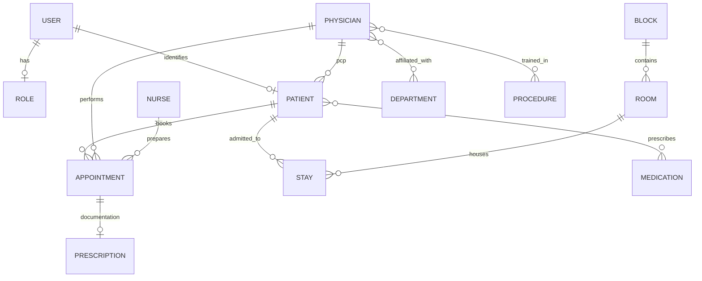

# HMS Database Architecture Documentation (v1.0)

This document serves as the authoritative guide to the Hospital Management System (HMS) data layer. It is designed for senior developers and database administrators to understand the schema, clinical relationships, and future microservices transition paths.

---

## 1. DATABASE OVERVIEW

*   **Database Engine**: MySQL / PostgreSQL (Relational)
*   **Total Table Count**: 18 (Including core entities and junction tables)
*   **Purpose**: To provide a highly available, consistent, and secure data layer for a multi-role healthcare facility, managing everything from staff scheduling to patient clinical records and financial dashboards.
*   **High-Level Data Domains**:
    *   **Users (Auth)**: Identity management using JSON Web Token (JWT) and Role-Based Access Control (RBAC).
    *   **Patients**: Core demographic and clinical identity tracking.
    *   **Staff**: Management of Physicians (with specialties) and Nurses.
    *   **Infrastructure**: Physical assets including Blocks (Wards) and Rooms.
    *   **Clinical Ops**: Appointments, Admissions (Stays), and medical record history.
    *   **Pharmacy**: Medication catalog and physician prescriptions.

---

## 2. FUNCTIONAL TABLE SCHEMA & BUSINESS LOGIC

### 2.1. Authentication & Security Module (Identity vs. Permissions)
*This domain acts as the "Passport Control" for the entire hospital system.*

| Table | Usage | Logic & Mechanism | Business Need |
| :--- | :--- | :--- | :--- |
| **`users`** | Login Identity. | Uses BCrypt hashing; links to Clinical Staff/Patients. | Basic identity gatekeeping. |
| **`roles`** | Permissions. | Defines strings like ROLE_ADMIN, ROLE_DOCTOR. | Implemented RBAC security. |
| **`user_roles`**| Junction. | Many-to-Many mapping for multi-role staff. | Organizational flexibility. |

#### 🛤️ Auth Workflow (The Sign-on Cycle)
1. **Registration**: Validates that a `staff_id` or `patient_ssn` exists in clinical tables BEFORE creating the user.
2. **Authentication**: Compares login email/hashed password from `users` table.
3. **Authorization**: Joins `user_roles` to collect authorities and generates a Secure JWT.

---

### 2.2. Staffing & Organizational Module
*Manages medical professionals and their hierarchy within the hospital.*

| Table | Usage | Logic & Mechanism | Business Need |
| :--- | :--- | :--- | :--- |
| **`physician`**| Lead Providers. | PK: `employeeid`. Own clinical treatment & orders. | Mandatory for prescribing. |
| **`nurse`** | Support Staff. | Includes `registered` flag for surgery eligibility. | Support accountability. |
| **`department`**| Units. | Master catalog; defines the unit "Head". | Organizational leadership. |
| **`affiliated_w`**| Mapping. | Many-to-Many junction with `primary_affiliation` flag. | Resource allocation & Rota. |

#### 🛤️ Staff Workflow (The Onboarding Cycle)
1. **Infrastructure**: Department is defined in the `department` table.
2. **Identity**: Physician/Nurse record is created in their respective staff tables.
3. **Hierarchy**: Affiliation junctions are created; one physician is appointed as the "Head".
4. **Access**: A `user` account is created, linking the staff ID to a system role.

---

### 2.3. Infrastructure Module
*Defines the physical environment where care is delivered.*

#### `block` & `room`
| Table | Usage | How it Works | Business Need |
| :--- | :--- | :--- | :--- |
| **`block`** | Floors or Wings. | Parent container for rooms (uses composite key). | Essential for navigation. |
| **`room`** | Patient locations. | Has an `unavailable` flag for stay management. | Hospital capacity tracking. |

---

### 2.4. Clinical Operations Module (The Patient Journey)
*Tracks the lifecycle of a person’s care from demographics to inpatient stays.*

| Table | Usage | Logic & Mechanism | Business Need |
| :--- | :--- | :--- | :--- |
| **`patient`** | Master ID. | Single Source of Truth; uses SSN as clinical PK. | Central hub for all care. |
| **`stay`** | Admissions. | Records physical occupancy; NULL `stayend` = active.| Bed mgmt and billing. |
| **`on_call`** | Rota. | Links Staff to specific Blocks for shift coverage. | Ensuring 24/7 care. |

#### 🛤️ Patient Workflow (The Admission Cycle)
1. **Registration**: Patient record created in `patient` table; assigned a Primary Care Physician (PCP).
2. **Encounters**: Appointments are logged for recurring clinics or one-off tests.
3. **Admission**: If needed, a `stay` record is opened (Start Date).
4. **Discharge**: The `stay` record is closed (End Date), releasing the room back to the Infrastructure pool.

---

### 2.5. Scheduling Module (The Coordinator)
*Manages the precise timing and resource allocation for outpatient encounters.*

| Table | Usage | Logic & Mechanism | Business Need |
| :--- | :--- | :--- | :--- |
| **`appointment`**| Bookings. | Junction: Staff + Patient + Room + Time. | Resource orchestration. |

#### 🛤️ Appointment Workflow (The Encounter Cycle)
1. **Booking**: Admin creates record with Patient and Physician (Nurse role is optional/pending).
2. **Preparation**: Assigned `prepnurse` performs initial vitals/prep tasks.
3. **Examination**: Physician performs the clinical task within the `start/end_time` window in the `examinationroom`.
4. **Follow-up**: Appointment ID is used as context for any resulting prescriptions or procedures.

---

### 2.6. Procedure & Compliance Module (The Clinical Logic)
*Ensures medical safety by linking treatments to qualified personnel.*

| Table | Usage | Logic & Mechanism | Business Need |
| :--- | :--- | :--- | :--- |
| **`procedures`** | Service Catalog. | Master list of surgeries/tests with `cost`. | Clinical planning and billing. |
| **`trained_in`** | Certifications. | Junction linking Physicians to authorized procedures. | **Safety & Compliance**. |
| **`undergoes`** | Clinical records. | Junction linking procedure to patient & stay. | Historical medical evidence. |

#### 🛤️ Procedure Workflow (The Treatment Cycle)
1. **Cataloging**: Admin defines procedures and costs (e.g., MRI Scan, Surgery).
2. **Certification**: Physicians are assigned certifications in `trained_in` (Checked for expiration).
3. **Execution**: A record is created in `undergoes` only if the Physician holds a valid certification.
4. **Billing**: Final costs are calculated by joining the undergone event with the master catalog.

---

### 2.7. Pharmacy & Medication Module (The Orders)
*Manages the inventory and issuance of medicinal treatments.*

| Table | Usage | Logic & Mechanism | Business Need |
| :--- | :--- | :--- | :--- |
| **`medication`** | Drug catalog. | Master data of names, brands, descriptions. | Prevents prescription errors. |
| **`prescribes`** | Clinical orders. | Junction: Physician + Patient + Med + Visit. | Legal treatment authorization. |

---

### 2.8. Infrastructure & Shift Module (The Physical Engine)
*Manages the spatial hierarchy of the hospital and the staff shift rotations.*

| Table | Usage | Logic & Mechanism | Business Need |
| :--- | :--- | :--- | :--- |
| **`block`** | Wings/Floors. | Master адрес system using composite keys. | Spatial categorization. |
| **`room`** | Patient Assets. | Tracks type and `unavailable` status. | Capacity management. |
| **`on_call`** | Shift Rota. | Junction linking Staff to Blocks for time windows. | 24/7 Response accountability. |

#### 🛤️ Infrastructure Workflow (The Spatial Cycle)
1. **Definition**: Admin defines Blocks and Floors (Address system).
2. **Asset Mapping**: Rooms are created and linked to specific Blocks.
3. **Shift Assignment**: Staff are assigned to Blocks in the `on_call` table for specific time windows.
4. **Emergency Response**: The system identifies the responsible staff by joining the current location (Room/Block) with the active `on_call` schedule.

---

## 3. RELATIONSHIPS BETWEEN TABLES

## 4. ER DIAGRAM (Mermaid)



---

## 5. CONSTRAINTS & DATA INTEGRITY

1.  **Identity Strategy**: Primary keys use `AUTO_INCREMENT` (Identity) to ensure unique, predictable sequencing across clinical incidents.
2.  **Soft Deletes**: Active clinical records (Patients, Physicians, Rooms) use an `is_deleted` BOOLEAN flag. **HARD DELETES are forbidden** to preserve audit trails.
3.  **Referential Integrity**: 
    *   `ON DELETE RESTRICT`: Prevents deleting a physician if they have active appointments.
    *   `ON DELETE CASCADE`: Used sparingly, primarily for junction tables like `user_roles`.

---

## 6. VALIDATION RULES

| Field | Level | Rule |
| :--- | :--- | :--- |
| `patient.ssn` | DB | Primary Key (Unique) |
| `stay.stayend`| Application | Must be after `staystart` |
| `room.unavailable`| Business | Room cannot be assigned to a new `Stay` if true |
| `email` | Application | Must follow regex pattern via `@Email` |
| `appointment.start`| Application | Must be in the future for new bookings |

---

## 7. DATA FLOW: PATIENT LIFECYCLE

1.  **Identity Creation**: Patient is registered ➔ `patient` table record created.
2.  **Scheduling**: `appointment` table record created, linking `patient_ssn`, `physician_id`, and `nurse_id`.
3.  **Admission**: If the appointment results in a stay, a `stay` record is created and the `room.unavailable` status is toggled to `true`.
4.  **Clinical Action**: Physician issues a prescription ➔ entries are made in the `prescribes` join table, linking the medication to the specific appointment context.

---

## 8. TRANSACTION MANAGEMENT

Atomic transactions are enforced at the Service layer using `@Transactional`:
*   **Admissions**: Booking a `Stay` and updating the `Room` status must succeed or fail together.
*   **Complex Prescriptions**: Linking multiple medications to a single clinical incident.

---

## 9. NORMALIZATION & PERFORMANCE

*   **Normalization**: The schema is strictly in **3NF**. Every non-key attribute is dependent on the key (e.g., Physician specialty is in the Staff table, not duplicated in Appointments).
*   **Performance Optimization**:
    *   **Index Suggested**: `patient(ssn)` and `appointment(start_time)` for fast retrieval of patient history.
    *   **N+1 Prevention**: Usage of `@EntityGraph` and `JOIN FETCH` for fetching Stays with their associated Rooms and Patients in a single query.

---

## 10. SECURITY CONSIDERATIONS

*   **PII Protection**: Personally Identifiable Information (PII) such as Social Security Number (SSN) and Phone numbers are considered highly sensitive. Suggested: Column-level encryption for the SSN field.
*   **Access Control**: Authorization is performed at the Filter Chain level (**Authorization Before Validation**) to ensure no user can trigger ID-based logic without verified permission.

---

## 11. COMMON QUERIES

**Get Patient History:**
```sql
SELECT p.name, pro.name, u.date_undergoes 
FROM undergoes u
JOIN patient p ON u.patient = p.ssn
JOIN procedures pro ON u.procedure = pro.code
WHERE p.ssn = 1001;
```

**Get Active Inpatients:**
```sql
SELECT p.name, r.roomnumber, s.staystart 
FROM stay s
JOIN patient p ON s.patient = p.ssn
JOIN room r ON s.room = r.roomnumber
WHERE s.stayend IS NULL;
```

---

## 12. MICROSERVICES DATA SPLIT MAP

When transitioning to Microservices architecture, the database will be split as follows:

| Service | Responsibility | Tables |
| :--- | :--- | :--- |
| **Auth Service** | Identity & Access | `users`, `roles`, `user_roles` |
| **Patient Service**| Clinical Identity | `patient` |
| **Staff Service** | HR & Specialties | `physician`, `nurse`, `department`, `trained_in` |
| **Schedule Service**| Appointments | `appointment`, `on_call` |
| **Facility Service**| Infrastructure | `room`, `block`, `stay` |
| **Pharmacy Service**| Medications | `medication`, `prescribes`, `procedures` |

---
*Generated by Antigravity AI - System Architecture v1.0*
